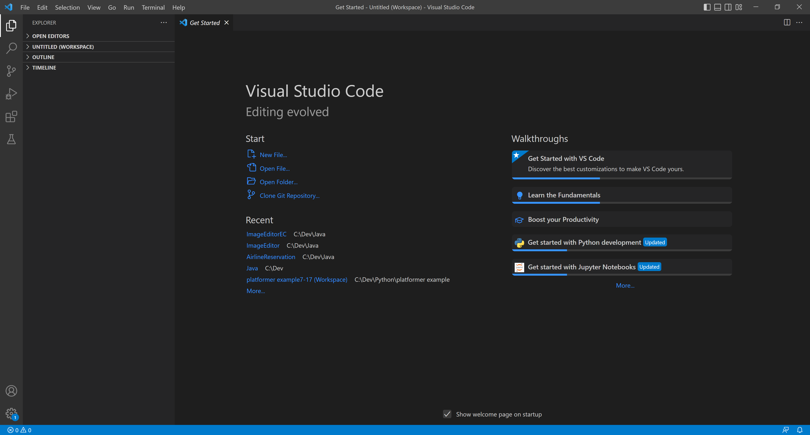
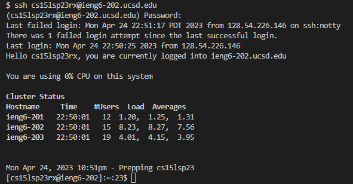
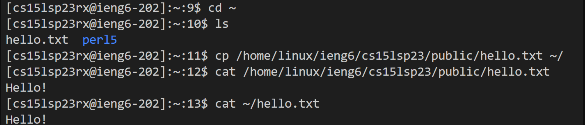

# Lab Report 1

## 1) Installing VSCode and Git
First, go to the [VSCode website](https://code.visualstudio.com/download) and install Visual Studio Code by following the directions provided there. Then, once VSCode is installed it should open up to a window like this:

Afterwards, also download [git](https://git-scm.com/book/en/v2/Getting-Started-Installing-Git) for windows by following the provided directions. 

## 2) Logging into the server
Once all of this is done, open a terminal window within VSCode and input git bash then hit enter. To do so, you can either click the terminal tab on the top then selecting new terminal once you have clicked it, or you can hit Shift + Enter + \` to quickly open one.

Before proceeding however, we should start with getting proper credentials. To do so go to the following link [to get your account specific CSE 15L account details](https://sdacs.ucsd.edu/~icc/index.php).

Once that has been done enter your username into this [password reset](https://password.ucsd.edu/GetUser.aspx) to set your password on your CSE 15L account.

Once you have done this then open a the terminal in VSCode (If it is already open then you can quickly access it with the shortcut Ctrl + \`). Also, make sure the terminal is a git bash terminal and not a regular powershell terminal. By clicking the arrow next to the plus on the right side of the terminal you can select which one you want to use. Then enter the following command but replace the zz with the specific letters of your cse15l account. 

`$ ssh cs15lsp23zz@ieng6.ucsd.edu`

Once you have done this you will probably be greeted by this message:

`⤇ ssh cs15lsp23zz@ieng6.ucsd.edu
The authenticity of host 'ieng6-202.ucsd.edu (128.54.70.227)' can't be established.
RSA key fingerprint is SHA256:ksruYwhnYH+sySHnHAtLUHngrPEyZTDl/1x99wUQcec.
Are you sure you want to continue connecting (yes/no/[fingerprint])?`

Since it will be your first time just say yes as this message is to be expected for your first time connecting to this server. If it is not your first time that may be cause for some concern.

Afterwards, it will prompt you for your password so just type it in. Don’t worry if what you type doesn’t appear this is just a privacy measure.

Once logged in your terminal should look like this:

Once you’re in, start off by trying some commands.

## 3) Running commands in the server
In this example I first did 
`cd ~` to get in to home directory then `ls` to see what's inside.

I then did `cp /home/linux/ieng6/cs15lsp23/public/hello.txt ~/` to copy the hello.txt file in question into the current home directory I was already in.

Then I tested the original hello.txt by printing it out with `cat /home/linux/ieng6/cs15lsp23/public/hello.txt` and then tested if the one in the home directory would print the same out by doing `cat ~/hello.txt`.

Of course, you can do your own commands but starting here may help you understand what each command such as `cd` or `ls` is doing in each scenario.

Finally, to close the connection to the server, you can either input `exit` or hit Ctrl + D to terminate your connection to the server.
