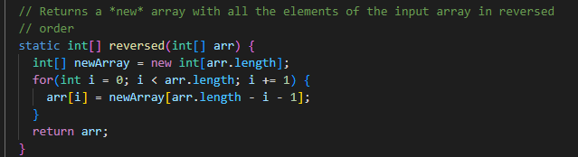

# Lab report 2

## Part 1

The main method in my code that is called to add these new strings is the `if (url.getPath().contains("/add-message"))` portion of my code.
This part will basically see if the URI I put in includes the /add-messages part of the URI that we determined we needed for this function to work.
Afterwards it breaks up the input by taking what comes after `?s=` and putting it into a string array. Then all I did was add some code that 
takes the new added word, and then transfers it to a string ArrayList to then be put onto the homepage. Specifically in this request, 
because `?s=` is followed by `Hola`, I then add Hola into storedWords.

The main method again is the `if (url.getPath().contains("/add-message"))` and everything else follows the exact same process as before. The only
difference this time around is that instead of Hola, a `Hello` is in front of the `?s=` portion of the URI. This means `paraneters[1]` will be Hello,
and thus will be added to storedWords.

## Part 2
**Bug input:**\

**Input that doesn't bug:**\

**Symptoms seen in cmd:**\

**Fixed code in ArrayExamples:**\
Before:\

After:\

This fixes the code because prior to this, what was happening was newArray was being created as an empty array that was the same length as the input array.
Then from this array, it was copying each value backwards into the output array to reverse it. However, this did not work for any array that either wasn't empty
or full of 0's because every iteration over the empty array would just put 0 in whatever index it was being sent to. In order to fix this, I cloned the first array 
that was to be reversed, then it could properly be iterated over backwards, thus fixing the method.

## Part 3

One thing I learned this week was how the JUnit tests actually worked. I had only really learned about them this quarter thanks to CSE 12, but I had no idea how they
really worked or what they even were. However, Lab 3 helped me gain a newfound understanding for them, and I now feel confident that I can use them in the terminal, and don't need to be guided around like a baby through an IDE to use it.
