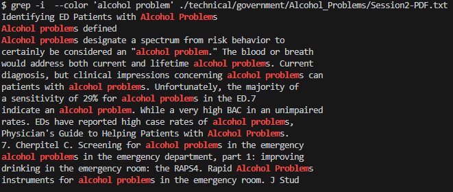

# Lab report 3
## The grep command
The grep command is a versatile command that can help us find certain words within files or texts
However, often when searching for certain words or letters, we need to ask a little bit more from grep.
### Additional lines after matches
By using -A n (with n being some number) after the grep command, we can use this to return n amount of lines after the things we found with grep.
For example, on a government document this could be useful to see what laws or bills fall under certain designations:
Without the modifier -A:
```console
$ grep '(A)' ./technical/government/Env_Prot_Agen/bill.txt
(A)
(A)
emit one ton of sulfur dioxide. (5)(A) The term "baseline heat
Notwithstanding subparagraph (A),
(A)
(A)
(A)
(A)
(A)
```
With -A
```console
$ grep '(A)' ./technical/government/Env_Prot_Agen/bill.txt -A 1
(A)
Under this part, a unit that is subject to emission
--
(A)
an authorization, by the Administrator under this title,
--
emit one ton of sulfur dioxide. (5)(A) The term "baseline heat
input" means, except under subpart 1 of part B and section 407, the
--
Notwithstanding subparagraph (A),

--
(A)
electricity; and
--
(A)
a statement that the facility will comply with all
--
(A)
one of the 48 contiguous States, Alaska, Hawaii, the
--
(A)
a fossil fuel-fired boiler, combustion turbine, or
--
(A)
sulfur dioxide allowances in an amount equal to the
--
(A)
such allowances may be used only to meet the requirements
--
```

Then for lines before you can just use -B to return them
```console
grep '(A)' ./technical/government/Env_Prot_Agen/bill.txt -B 1

(A)
--

(A)
--

emit one ton of sulfur dioxide. (5)(A) The term "baseline heat
--
(B)
Notwithstanding subparagraph (A),
--

(A)
--

(A)
--

(A)
--

(A)
--

(A)
--

(A)
--
```

### Finding only the word inputted into grep
Sometimes while using grep, we only want to count how many times a certain word came up, and when grep returns whole lines by default,
it can get cumbersome to then count them all by hand (if you were doing that). One way this can be avoided is by using -o in our grep command to only return 
the words that exactly match what we search for.
Let's say for instance we wanted to count how many times a George was involved in the chapter 13 of the 9/11 documents.
We could find out with the following search:
```console
grep 'George' ./technical/911report/chapter-13.*.txt
./technical/911report/chapter-13.2.txt:                members of the Commission staff are cited, for example, as "George Tenet interview
./technical/911report/chapter-13.2.txt:                Joint Inquiry is cited as "Joint Inquiry testimony of GeorgeTenet, Oct. 17, 2002,"
./technical/911report/chapter-13.3.txt:            85. George Tenet testimony, Mar. 24, 2004; George Tenet testimony, Apr. 14, 2004.
./technical/911report/chapter-13.3.txt:                budget, see George Tenet prepared statement, Mar. 24, 2004, pp. 23-26. The DCI added
./technical/911report/chapter-13.3.txt:                see George Tenet testimony, Mar. 24, 2004.
./technical/911report/chapter-13.3.txt:                2003); George Tenet interview (Jan. 22, 2004).
./technical/911report/chapter-13.3.txt:                interview (Dec. 17, 2003); James Pavitt interview (Jan. 8, 2004); George Tenet
./technical/911report/chapter-13.3.txt:                (Jan. 14, 2004); George Tenet interview (Jan. 22, 2004); Richard Clarke interview
./technical/911report/chapter-13.3.txt:                see Joint Inquiry testimony of George Tenet, Oct. 17, 2002. For Clarke's comment to
./technical/911report/chapter-13.3.txt:                attack, see NSC memo, Clarke to Berger, Jan. 12, 1999. See also George Tenet
./technical/911report/chapter-13.3.txt:                manager, operator, and lawyer's view, see GeorgeTenet interview (Jan. 22, 2004);
./technical/911report/chapter-13.3.txt:            170. Ibid.; Benjamin and Simon, Age of Sacred Terror, pp. 338-399; George Tenet
./technical/911report/chapter-13.3.txt:            171. George Tenet interview (Jan. 22, 2004).
./technical/911report/chapter-13.3.txt:            176. George Tenet interview (Jan. 22, 2004); John Gordon interview (May 13, 2004).
./technical/911report/chapter-13.3.txt:                Testimony of George Tenet before the House Permanent Select Committee on
./technical/911report/chapter-13.3.txt:                Randy Moss interview (Jan. 22, 2004); George Tenet interview (Jan. 22, 2004). On the
./technical/911report/chapter-13.4.txt:                5,1996, remarks at George Washington University, he called terrorism "the enemy of
./technical/911report/chapter-13.4.txt:            15. George Tenet interview (Jan. 22, 2004); George Tenet prepared statement, Mar. 24,
./technical/911report/chapter-13.4.txt:            31. Samuel Berger interview (Jan. 14, 2004); George Tenet interview (Jan. 22, 2004).
./technical/911report/chapter-13.4.txt:            54. See, e.g., Joint Inquiry testimony of GeorgeTenet, Oct.17,2002, pp.110-112; DOJ
./technical/911report/chapter-13.4.txt:                George Tenet interview (Jan. 22, 2004). Tenet described the millennium alert as
./technical/911report/chapter-13.4.txt:                meeting with Berger, see George Tenet interview (Jan. 28, 2004).
./technical/911report/chapter-13.4.txt:            74. Joan Dempsey interview (Nov. 12, 2003); George Tenet interview (Jan. 22, 2004).
./technical/911report/chapter-13.4.txt:                of the millennium alerts. George Tenet interview (Jan. 22, 2004). The incident was,
./technical/911report/chapter-13.4.txt:            150. George Tenet interview (Jan. 28, 2004).
./technical/911report/chapter-13.4.txt:                considered by the new administration, see George Tenet interview (Jan. 28, 2004);
./technical/911report/chapter-13.4.txt:                said to the President-elect. George Tenet interview (Jan. 28, 2004). He told us,
./technical/911report/chapter-13.4.txt:                asked for the additional authority. See George Tenet testimony, Mar. 24, 2004. The
./technical/911report/chapter-13.4.txt:            170. President Bush and Vice President Cheney meeting (Apr. 29, 2004); GeorgeTenet
./technical/911report/chapter-13.4.txt:            176. George Tenet interview (Jan. 28, 2004).
./technical/911report/chapter-13.4.txt:            241. George Tenet interview (Jan. 28, 2004); Charles Allen interview (Jan. 27, 2004).
./technical/911report/chapter-13.4.txt:                of investigation, interviews of Samuel George Coombs, Apr. 8, 2002; July 24, 2002;
./technical/911report/chapter-13.4.txt:                interview of George Harb, Oct. 30, 2001. Hazmi and Mihdhar appear to have used
./technical/911report/chapter-13.4.txt:            27. FBI report of investigation, interview of George Harb, Sept. 16, 2001. The
./technical/911report/chapter-13.5.txt:                Nawaf had a minor car accident traveling eastbound on the George Washington Bridge,
./technical/911report/chapter-13.5.txt:            30. George Tenet interview (Jan. 28, 2004).
./technical/911report/chapter-13.5.txt:            40. George Tenet interview (July 2, 2004).
./technical/911report/chapter-13.5.txt:            60. For Tenet and Black testimony, see Joint Inquiry testimony of George Tenet, Oct.
./technical/911report/chapter-13.5.txt:            104. George Tenet interviews (Jan. 28, 2004; July 2, 2004).
./technical/911report/chapter-13.5.txt:                Rice meeting (Feb. 7, 2004); George Tenet interview (Jan. 28, 2004).
./technical/911report/chapter-13.5.txt:            41. George Tenet interview (Jan. 22, 2004); James Pavitt interview (Jan. 8, 2004).
./technical/911report/chapter-13.5.txt:            28. Testimony of George Tenet, "The Worldwide Threat 2004: Challenges in a Changing
./technical/911report/chapter-13.5.txt:                deconfliction. George Tenet interview (July 2, 2004). We have not received any
./technical/911report/chapter-13.5.txt:                working group on the subject. George Tenet prepared statement, Mar. 24, 2004, p. 37.
```
However, as mentioned previously this gets very unwieldy. So let's simplify this list to only show Georges by using -o:
```console
$ grep -o 'George' ./technical/911report/chapter-13.*.txt
./technical/911report/chapter-13.2.txt:George
./technical/911report/chapter-13.2.txt:George
./technical/911report/chapter-13.3.txt:George
./technical/911report/chapter-13.3.txt:George
./technical/911report/chapter-13.3.txt:George
./technical/911report/chapter-13.3.txt:George
./technical/911report/chapter-13.3.txt:George
./technical/911report/chapter-13.3.txt:George
./technical/911report/chapter-13.3.txt:George
./technical/911report/chapter-13.3.txt:George
./technical/911report/chapter-13.3.txt:George
./technical/911report/chapter-13.3.txt:George
./technical/911report/chapter-13.3.txt:George
./technical/911report/chapter-13.3.txt:George
./technical/911report/chapter-13.3.txt:George
./technical/911report/chapter-13.3.txt:George
./technical/911report/chapter-13.3.txt:George
./technical/911report/chapter-13.4.txt:George
./technical/911report/chapter-13.4.txt:George
./technical/911report/chapter-13.4.txt:George
./technical/911report/chapter-13.4.txt:George
./technical/911report/chapter-13.4.txt:George
./technical/911report/chapter-13.4.txt:George
./technical/911report/chapter-13.4.txt:George
./technical/911report/chapter-13.4.txt:George
./technical/911report/chapter-13.4.txt:George
./technical/911report/chapter-13.4.txt:George
./technical/911report/chapter-13.4.txt:George
./technical/911report/chapter-13.4.txt:George
./technical/911report/chapter-13.4.txt:George
./technical/911report/chapter-13.4.txt:George
./technical/911report/chapter-13.4.txt:George
./technical/911report/chapter-13.4.txt:George
./technical/911report/chapter-13.4.txt:George
./technical/911report/chapter-13.4.txt:George
./technical/911report/chapter-13.4.txt:George
./technical/911report/chapter-13.5.txt:George
./technical/911report/chapter-13.5.txt:George
./technical/911report/chapter-13.5.txt:George
./technical/911report/chapter-13.5.txt:George
./technical/911report/chapter-13.5.txt:George
./technical/911report/chapter-13.5.txt:George
./technical/911report/chapter-13.5.txt:George
./technical/911report/chapter-13.5.txt:George
./technical/911report/chapter-13.5.txt:George
./technical/911report/chapter-13.5.txt:George
```

However, we can further simplify this. If we only wanted to count just the raw Georges then we can add -oh instead of -o to remove the file locations:
```console
$ grep -oh 'George' ./technical/911report/chapter-13.*.txt
George
George
George
George
George
George
George
George
George
George
George
George
George
George
George
George
George
George
George
George
George
George
George
George
George
George
George
George
George
George
George
George
George
George
George
George
George
George
George
George
George
George
George
George
George
George
```

### Searching through a whole directory
Although you can already search through the same files by using a \* followed by the file format, but what if you wanted to go through
every file within a directory?
For this example within Alcohol-Problems I changed the file type of Session2-PDF.txt to a .txt-test to show that iterating with \*.txt won't work:
```console
$ grep 'Michigan' ./technical/government/Alcohol_Problems/*.txt
./technical/government/Alcohol_Problems/Session4-PDF.txt:20. Selzer ML. The Michigan Alcoholism Screening Test: the
```
Now, inside Session2-PDF.txt-test, there are many mentions of Michigan so let us use a -r modifier to recursively iterate through each file within Alcohol-Problems:
```console
$ grep -r 'Michigan' ./technical/government/Alcohol_Problems
./technical/government/Alcohol_Problems/Session2-PDF.txt.test:The MAST (Michigan Alcohol-Screening Test), developed in 1971 as
./technical/government/Alcohol_Problems/Session2-PDF.txt.test:the CAGE, the Brief Michigan Alcoholism Screening Test, and the
./technical/government/Alcohol_Problems/Session2-PDF.txt.test:version of the Michigan Alcoholism Screening Test. Am J Psychiatry
./technical/government/Alcohol_Problems/Session2-PDF.txt.test:27. Selzer M. The Michigan Alcoholism Screening Test: the quest
./technical/government/Alcohol_Problems/Session2-PDF.txt.test:Short Michigan Alcoholism Screening Test (SMAST). J Stud Alcohol
./technical/government/Alcohol_Problems/Session2-PDF.txt.test:the CAGE, the Brief Michigan Alcohol Screening Test, and the
./technical/government/Alcohol_Problems/Session4-PDF.txt:20. Selzer ML. The Michigan Alcoholism Screening Test: the
```
Now, we can see that not only are .txt files shown, but thanks to -r, we also were able to scan through .txt-test files to find what we needed.
On top of this however, we can add other modifiers to r to get what we want.
For this example, I want to find only the words michigan, and I want their line location within Alcohol-Problems (-n is what gets us the line number):
```console
$ grep -rno 'Michigan' ./technical/government/Alcohol_Problems
./technical/government/Alcohol_Problems/Session2-PDF.txt.test:172:Michigan
./technical/government/Alcohol_Problems/Session2-PDF.txt.test:443:Michigan
./technical/government/Alcohol_Problems/Session2-PDF.txt.test:502:Michigan
./technical/government/Alcohol_Problems/Session2-PDF.txt.test:504:Michigan
./technical/government/Alcohol_Problems/Session2-PDF.txt.test:508:Michigan
./technical/government/Alcohol_Problems/Session2-PDF.txt.test:536:Michigan
./technical/government/Alcohol_Problems/Session4-PDF.txt:611:Michigan
```
So, not only can we iterate through a whole directory recursively, we can also add other modifiers to narrow down what we want.

### Using color to see what you need better
Often times, when grep returns a big string of letters and words, it can be difficult to find what you need. However, to curb this one can use `--color` within their grep command to highlight words they were searching for

Unfortunately, because of the limitations of markdown, it does not preseve the added color when this command is ran, so images will be added to show what it looks like within the VSCode terminal
```console
$ grep -r --color  'George W. Bush' ./technical/911report
./technical/911report/chapter-1.txt:    Tuesday, September 11, 2001, dawned temperate and nearly cloudless in the eastern United States. Millions of men and women readied themselves for work. Some made their way to the Twin Towers, the signature structures of the World Trade Center complex in New York City. Others went to Arlington, Virginia, to the Pentagon. Across the Potomac River, the United States Congress was back in session. At the other end of Pennsylvania Avenue, people began to line up for a White House tour. In Sarasota, Florida, President George W. Bush went for an early morning run.
./technical/911report/chapter-3.txt:                to be Presidential Decision Directives; for President George W. Bush, National
./technical/911report/chapter-6.txt:                Gore or his Republican opponent, Texas Governor George W. Bush, would become
./technical/911report/chapter-8.txt:                President ==George W. Bush== on August 6, 2001.37 Redacted material is indicated by
```


In this example, since the lines that were returned were hard to read, highlighting them using `--color` made it much easier to distinguish what was being searched for.

This can help find where words are, as well as making sure some context can be included as well (compared to if we have just used -o):
```console
$ grep -i  --color 'alcohol problem' ./technical/government/Alcohol_Problems/Session2-PDF.txt
Identifying ED Patients with Alcohol Problems
Alcohol problems defined
Alcohol problems designate a spectrum from risk behavior to
certainly be considered an "alcohol problem." The blood or breath
would address both current and lifetime alcohol problems. Current
diagnosis, but clinical impressions concerning alcohol problems can
patients with alcohol problems. Unfortunately, the majority of
a sensitivity of 29% for alcohol problems in the ED.7
indicate an alcohol problem. While a very high BAC in an unimpaired
rates. EDs have reported high case rates of alcohol problems,
Physician's Guide to Helping Patients with Alcohol Problems.
7. Cherpitel C. Screening for alcohol problems in the emergency
alcohol problems in the emergency department, part 1: improving
drinking in the emergency room: the RAPS4. Rapid Alcohol Problems
instruments for alcohol problems in the emergency room. J Stud
```


Here -i just tells grep to ignore cases.

All of these examples were found either within [this guide](https://www.cyberciti.biz/faq/grep-in-bash/#:~:text=The%20grep%20command%20searches%20the,the%20screen%20or%20bash%20terminal.) or from the man grep lookup within the console.
