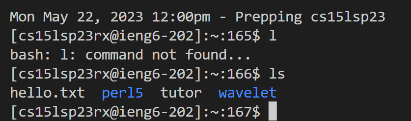

# Lab Report 4
## Baseline Tasks

### Step 1 
By using `$ rm -rf lab7` while in the home directory, I was able to delete any leftover instances of lab 7.

### Step 2 
Created a fork on github from the [original repository](https://github.com/ucsd-cse15l-s23/lab7) given in class.

### Step 3
Timer started
 
### Step 4
Because I had an ssh key already from generating one as outlined by the lab, I was able to just log in with `$ ssh ucsd15lsp23rx@ieng6.ucsd.edu`.


### Step 5
Next I used `$ git clone https://github.com/zymiller/lab7` to clone my fork of the repository into a folder called lab7 within the home directory (important that it's the fork being cloned).
 

### Step 6
To show tests failed, I first got into the cloned repository with `$ cd lab7`. Then I ran the bash script which will run all the tests, by doing `$ bash test.sh`. This gave me the following failed test output:
```
JUnit version 4.13.2
..E
Time: 0.539
There was 1 failure:
1) testMerge2(ListExamplesTests)
org.junit.runners.model.TestTimedOutException: test timed out after 500 milliseconds
        at ListExamples.merge(ListExamples.java:43)
        at ListExamplesTests.testMerge2(ListExamplesTests.java:19)

FAILURES!!!
Tests run: 2,  Failures: 1
```


### Step 7
To remedy this, the file ListExamples.java needs to be edited. To first enter the editor I typed `$ vim ListExamples.java` to get into the file. Then afterwards I just went down the appropriated amount of times
until I was at the line needing change (for some reason each time I run this test, my starting location changes so I can't say for sure how much you will need to move but for this instance I moved `<down>` 3 times.
Then once I got to the line, I then hit `<e>` to get to the end of the first word (getting to the 1 in index1), then used `<r>` to replace 1, then hit `<2>` to finally replace the 1 with a 2. Finally
I finished with `<:wq>` to save the file and exit.


### Step 8
Now we can hit `<up><up>` to get to the command before the previous one (`$ bash test.sh`) and run it to see if we fixed the issue. If everything went well we should see the following:
```
JUnit version 4.13.2
..
Time: 0.013

OK (2 tests)
```


### Step 9
Now to finish, I can now push this to the origin. To do so first I can do `$ git add -A` which will add all changes to the commit. Then to make sure this commit will be sent through (and can be understood) a message should be added using `$ git commit -m "<message>"`. Once this is completed we can finally push this to the origin using `$ git push origin main`. However, beware that to do so you must have a valid SSH key linked to your GitHub account to the machine you're using. Once this is complete your terminal should say this and you are finished: 


