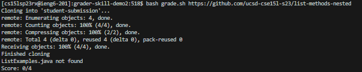
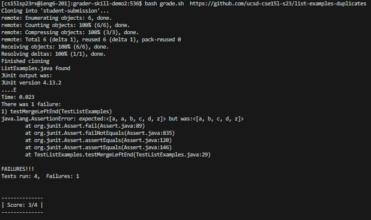

# Lab Report 5
## Debugging Post
**What environment are you using (computer, operating system, web browser, terminal/editor, and so on)?**
On the ieng6 remote server

**Detail the symptom you're seeing. Be specific; include both what you're seeing and what you expected to see instead. Screenshots are great, copy-pasted terminal output is also great. Avoid saying “it doesn't work”**
I'm trying to run the autograder on the input repository but it errors out and says that the file can't be found even though I know its in the repository. Here's the repository used: [https://github.com/ucsd-cse15l-s23/list-methods-nested
](https://github.com/ucsd-cse15l-s23/list-methods-nested)

**Detail the failure-inducing input and context. That might mean any or all of the command you're running, a test case, command-line arguments, working directory, even the last few commands you ran. Do your best to provide as much context as you can.**
Just doing the regular `bash grade.sh https://github.com/ucsd-cse15l-s23/list-methods-nested` gives me the error that `ListExamples.java not found`.

## TA Response
Try running `bash grade.sh https://github.com/ucsd-cse15l-s23/list-examples-duplicates` and then run the bash script again to see what happens. If it works then you know that the script can't read from nested files.

## Test After TA Response

This new directory is the same as the other, but with a non nested ListExamples.java file. Because this worked and graded properly, then you know that the script can't read nested files, and that issue needs to be fixed

## Summary
First you needed a directory with a grade.sh script and TestListExamples.java (along with the two libraries for ther junit tests), then a subdirectory of student-submissions=. Before fixing, the student-submissions file 
would have another subdirectory called pa1 which contained the ListExamples.java file that the student attempted to test using grade.sh. 

To trigger said bug, the student would just run `bash grade.sh https://github.com/ucsd-cse15l-s23/list-methods-nested` which would return an output saying that ListExamples.java didn't exist.

To fix this, the bash script needs to be edited in order to search the files cloned into student-submissions recursively, so it can make sure ListExamples.java isn't hiding in one of the directories.

## Reflection
I think the coolest thing I learned from this class, was the use of vim inside the remote server. Prior to this class I had only known vim as a program that you could install and use on your own personal computer
as a text editor but I never knew it could be used in the remote server in the way that we did it. Learning vim also got over some of the scary learning curve that I had always heard associated with vim, so it 
was nice that we learned how to use vim as it was something that always intimidated me.
